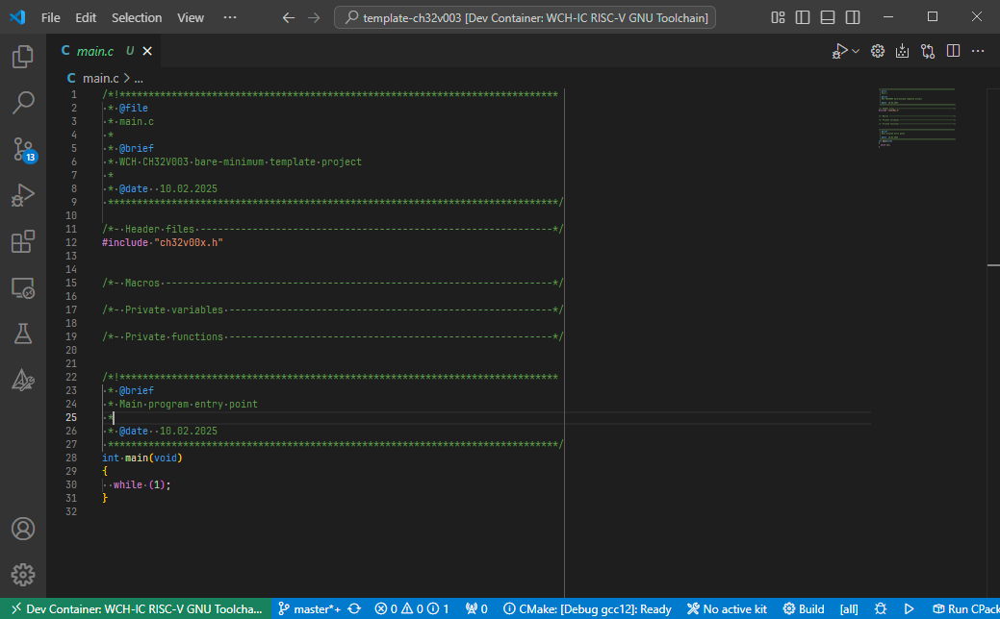

# template-ch32v003 [](https://t.co/Qbblvmfbae)

A bare-minimum template for your next project using the ultra low-cost WCH CH32V003 RISC-V MCU!

<p align="center"></p>

You can find a fully working example at [islandcontroller/hello-ch32v003](https://github.com/islandcontroller/hello-ch32v003)!

## Requirements

* Hardware
  * WCH CH32V003 microcontroller
  * WCH-LinkE Debugger
* Software
  * Linux OS or WSL installation
  * [Docker Engine](https://docs.docker.com/engine/install/debian/) (running within WSL if applicable)
  * VSCode [Dev Containers](https://marketplace.visualstudio.com/items?itemName=ms-vscode-remote.remote-containers) extension
  * (WSL only) [usbipd-win](https://learn.microsoft.com/en-us/windows/wsl/connect-usb)

## Getting Started

* Click on "**Use this template**" to create your own fork of this template.
* Clone the forked repository using the following command. Note the use of the `--recursive` tag.
  ```
  git clone --recursive https://github.com/<your username here>/template-ch32v003
  ```
* Open the folder in VSCode
* Connect WCH-Link debug probe
  * (WSL only) attach to WSL using `usbipd attach --wsl --busid <...>`. **This needs to be completed before starting the Dev Container.**
* Run the command "**Dev Containers: Reopen in Container**"
  * On first launch, you may need to install some udev rules on your host machine. Copy the files to your workspace by running `setup-devcontainer` inside the container.
  * Re-open the workspace on your host and run the `install-rules` script inside the `.vscode/setup` folder.

        cd .vscode/setup
        sudo ./install-rules

  * Afterwards, restart the devcontainer.
* Upon prompt, select the "`WCH RISC-V Toolchain x.x`" CMake Kit. 
* Run "**CMake: Configure**"
* Build using "**CMake: Build [F7]**"

### Serial Monitor

A serial port monitor is included in the devcontainer. To launch the serial monitor, use:

    cu -l /dev/ttyACM0 -s <baudrate>

To close the connection later on, press ESC/ENTER, type `~.` (tilde, dot) and wait for 3 seconds.

### Customization

* [CMakeLists.txt](CMakeLists.txt)
  * Change the name and description in the `project(...)` command.
  * Place additional include directories in the `include_directories(...)` command.
  * Source files are added automatically if they have a `.c` or `.S` file extension.
* [.vscode/launch.json](.vscode/launch.json)
  * Adjust the ELF binary in the `program` field to match the project name.

## Help and References

* [islandcontroller/hello-ch32v003](https://github.com/islandcontroller/hello-ch32v003) Example project
* [openwch/ch32v003](https://github.com/openwch/ch32v003) Manufacturer EVT demos and documentation
* [WCH-IC: CH32V003DS0.pdf](http://www.wch-ic.com/downloads/CH32V003DS0_PDF.html) MCU Datasheet
* [WCH-IC: CH32V003RM.pdf](http://www.wch-ic.com/downloads/CH32V003RM_PDF.html) MCU Reference Manual
* [WCH-IC: QingKeV2_Processor_Manual.pdf](http://www.wch-ic.com/downloads/QingKeV2_Processor_Manual_PDF.html) Processor Core Manual

If you're looking for further information about WCH products, check out their community Discord server: 
[](https://t.co/Qbblvmfbae)